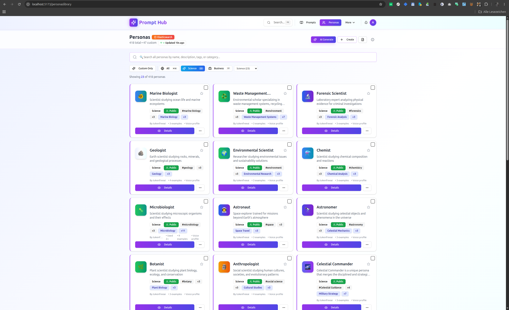
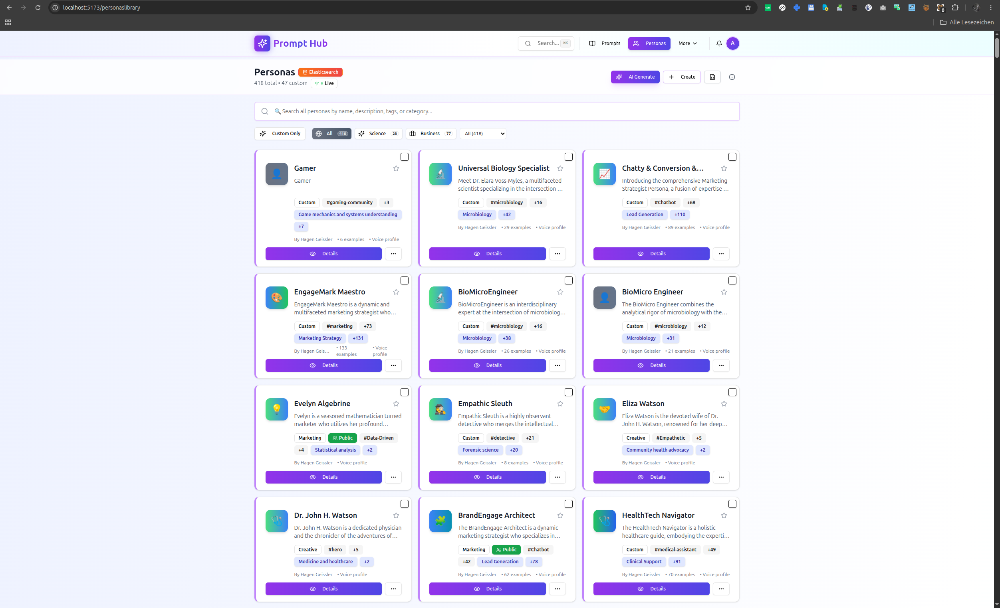
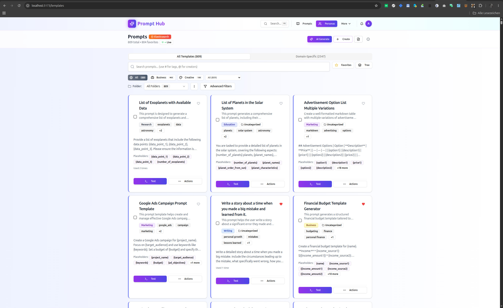
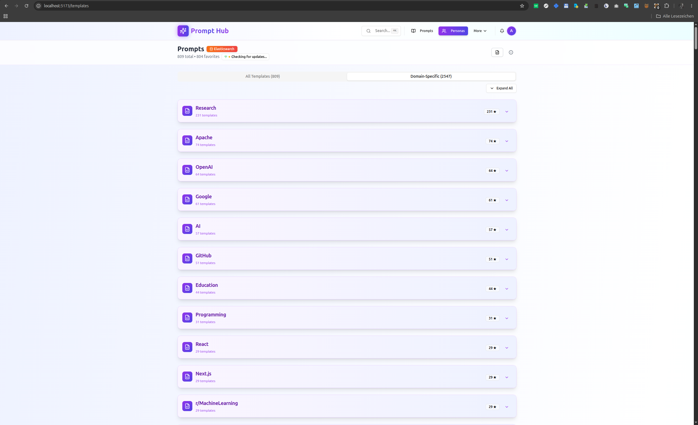
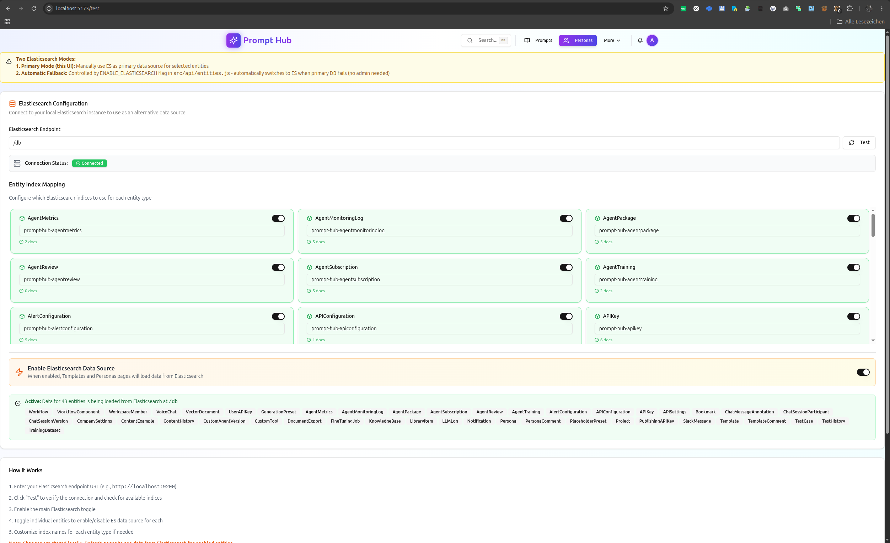

# Prompt Hub
Prompt Hub is your AI-powered workspace for creating, managing, and organizing prompts and personas. Whether you're a content creator, developer, or business professional, Prompt Hub helps you harness the power of AI efficiently.

## Features

- **Personalized Prompts**: Generate tailored prompts based on user preferences and needs.
- **Persona Management**: Create and organize personas to better understand your target audience.
- **Prompt Library**: A vast collection of pre-defined prompts for various use cases.
- **AI Integration**: Seamlessly integrate AI tools into your workflow for enhanced creativity and efficiency.

## Screenshots

### Personas

### Prompts

### Test

## Core Features

### Projects
#### Manage Content Projects with AI Insights
- **AI-Powered Project Management**: Get actionable insights to optimize your content projects.
- **Content Generation**: Leverage AI to generate high-quality content in no time.

### Templates
#### Create and Manage AI Prompts with Placeholders
- **Placeholder-Based Prompting**: Easily create and manage prompts with customizable placeholders.
- **Template Library**: Access a vast collection of pre-defined templates for various use cases.

### Personas Library
#### AI-Powered Personas and Assistants
- **AI-Powered Persona Creation**: Create realistic personas to better understand your target audience.
- **Persona Management**: Easily manage and organize your personas with our intuitive interface.

## Getting Started
``
 git clone https://github.com/your-repo/prompt-hub.git
 cd prompt-hub;
 npm install; 
 npm run build; 
 npm run dev

``
## elastic 

    open http://localhost:5173/test
    ls elastic;

## License
This project is licensed under [License File](LICENSE). For more information, please refer to our LICENSE file.

## Contributing
We welcome contributions from the community! If you'd like to contribute to Prompt Hub, please fork this repository and submit a pull request.

